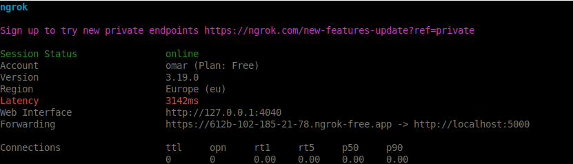

# Applyed Mini-RAG project

Before using the app run:
```bash
pip install -r requirements.txt
```

Don't Forget to set up configuration from the template `.env.example`:
```bash
cat .env.example > .env
```

Run the univcorn command like this:
```bash
uvicorn main:app --reload --host 0.0.0.0 --port 5000
```

To use it globaly, you can use ngrok which forward your localserver endpoint to public endpoint:
```bash
ngrok http <your-uvicorn-server-endpoint>
```

"
